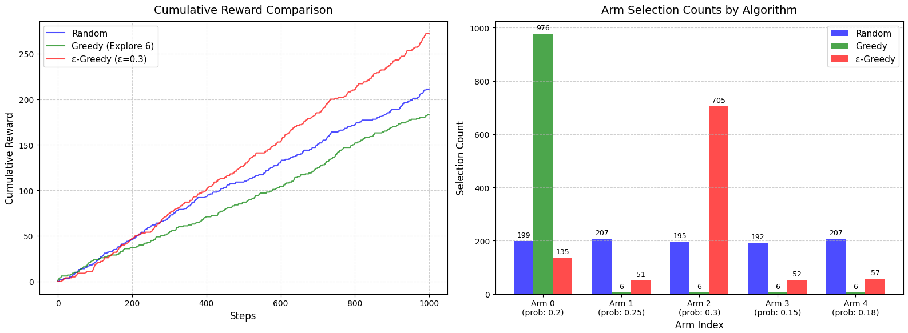
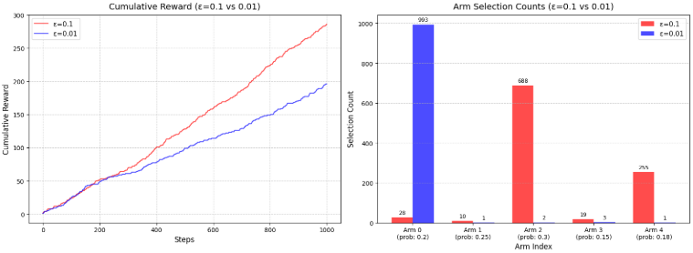

# Multi-Armed Bandit (MAB) 알고리즘 분석

## 1. 핵심 통계학 및 수학 개념

- **베르누이 분포 (Bernoulli Distribution):** 오직 두 가지의 가능한 결과(예: 당첨/꽝, 1/0)만을 갖는 단일 사건(시행)의 확률 분포입니다.
- **독립 시행 (Independent Trials):** 단일 사건 이전에 당첨되었다고 다음 당첨 확률이 내려가지 않듯, 이전의 결과가 다음의 결과에 전혀 영향을 미치지 않는 성질을 뜻합니다.
- **확률 분포 (Probability Distribution):** 어떤 확률적 사건에서 일어날 수 있는 모든 결과값과 그 결과가 나타날 확률의 크기를 서로 짝지어 보여주는 수학적 지도(Map)입니다.
- **알고리즘 이론 (대수의 법칙):** 베르누이 분포를 따르는 환경에서 탐색을 반복할수록 표본의 평균 보상이 실제 머신의 당첨 확률로 수렴하게 됩니다.

---

## 2. 환경 설정 (Environment Setup)

- 총 5개의 슬롯머신(레버)이 존재하며, 각 머신은 서로 다른 숨겨진 당첨 확률(평균 보상: 0.2, 0.25, 0.3, 0.15, 0.18)을 가지고 있습니다.
- 에이전트는 레버를 당겼을 때 확률에 따라 1(당첨) 또는 0(꽝)의 보상을 받으며, 총 1,000번 반복 학습하며 최적의 머신을 찾아냅니다.

---

## 3. 알고리즘 작동 원리 및 결과

### 3.1. Random 알고리즘

- **작동 방식:** 확률이나 과거의 결과에 상관없이 5개의 머신 중 매 스텝 무작위로 하나를 선택하여 당깁니다.
- **결과 요약:** 총 보상은 약 230점 내외로 발생하며, 1,000번의 반복 동안 5개의 머신이 각각 약 200회 내외로 균등하게 1/n씩 고르게 선택됩니다.

### 3.2. Greedy 알고리즘

- **작동 방식:** 초기 탐색 단계로 각 머신을 6번씩 강제로 실행(총 30번)하여 결과를 측정합니다. 이후 6번의 탐색 결과 가장 높은 평균 보상을 준 단 하나의 머신만 선택하여, 남은 970번 동안 계속 그 머신만 당깁니다(Exploitation).
- **결과 요약:** 총 보상은 약 310점 내외로 높게 발생합니다. 하지만 극초반 30번의 우연한 결과에 의해 1위로 선정된 머신이 남은 970번의 기회를 모두 독식하므로, 최적의 머신을 찾지 못하고 오류(Local Optima)에 빠질 위험이 큽니다.

### 3.3. ε-Greedy 알고리즘

- **작동 방식:** 0에서 1 사이의 랜덤값을 뽑아, 사전에 설정한 ε(epsilon, 예: 0.3) 값과 비교합니다. 랜덤값이 ε보다 작으면 무작위로 탐색(Random)하고, 크면 지금까지 계산된 평균 보상이 가장 큰 머신을 선택(Greedy)하여 탐색과 활용의 균형을 맞춥니다.
- **결과 요약:** 총 보상은 약 269점 내외로 발생합니다. 실제 당첨 확률이 가장 높은 머신(0.3)에 선택이 가장 많이 집중(약 670회)되면서도, 다른 머신들 역시 무작위 탐색에 의해 최소한의 실행 기회를 보장받으며 유연하게 학습합니다.

---

## 4. 결과 시각화 지표

> **알고리즘별 성능 차이를 대조하기 위해 주로 두 가지 지표를 병렬로 비교합니다.**

- **(왼쪽) 누적 보상 선 그래프 (Cumulative Reward Curve):** 1,000번 반복하는 동안 시간에 따른 누적 보상의 상승 추세(기울기)를 비교
- **(오른쪽) 머신별 선택 횟수 막대 그래프 (Arm Selection Counts):** 1,000번의 스텝이 끝난 후, 각 알고리즘이 5개의 머신에 자원(선택 횟수)을 어떻게 분배하고 편향되었는지 직관적으로 보여줍니다.

> **입실론 값에 따른 변화**

- **(오른쪽) 선택횟수:** 앱실론 값이 내려갈수록 greedy 알고리즘과 비슷해짐 → 앱실론 값보다 낮을 때는 random 전략을, 높을 때는 지금까지의 누적 평균 보상이 가장 높은 머신을 선택하도록 구현했기 때문에

---

## 5. 질문

1. Greedy 전략은 왜 실패할 수 있나?
   - 초기의 적은 경우의 수로 이후를 판단하기 때문에, 초기 선택으로 성능이 정해짐 → 경우의 수가 적기 때문에 최악의 머신 선택 가능성 ↑

2. ε값이 너무 크면 어떤 문제가 발생할 수 있나?
   - 보상을 극대화(Exploitation)해야 하는 타이밍에도 불필요한 무작위 탐험을 반복하여, 최종 누적 보상의 최대치가 현저히 낮아지게 된다.

3. ε값이 너무 작으면 어떤 문제가 발생할 수 있나?
   - 탐험을 거의 하지 않기 때문에, 자신이 틀렸다는 사실을 깨닫고 진짜 최적의 기계로 갈아타는 데 실패할 위험이 크다.

4. Exploration이 필요한 이유?
   - 에이전트는 초기에 환경(각 기계의 실제 잭팟 확률)에 대해 아무것도 모르는 상태이기 때문에, 탐험은 당장의 작은 보상을 포기하더라도 '정보'를 획득하기 위한 장기적 투자이다.
   - 궁극적으로 미래에 얻을 총 보상(Cumulative Reward)을 극대화하기 위해서는, 현재 아는 것 중 가장 좋은 것을 선택하는 것(활용)과 더 좋은 것이 있는지 미지의 영역을 확인하는 것(탐험) 사이의 논리적인 밸런스가 필수적이다.
